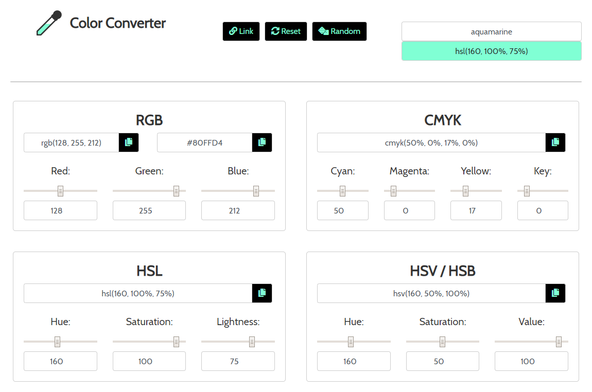
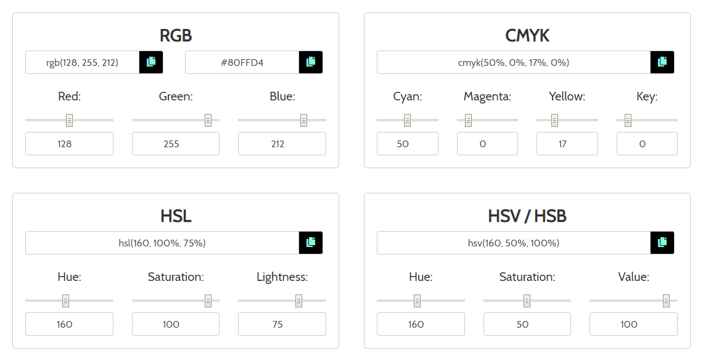
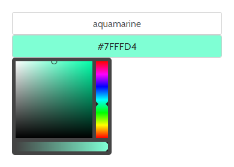
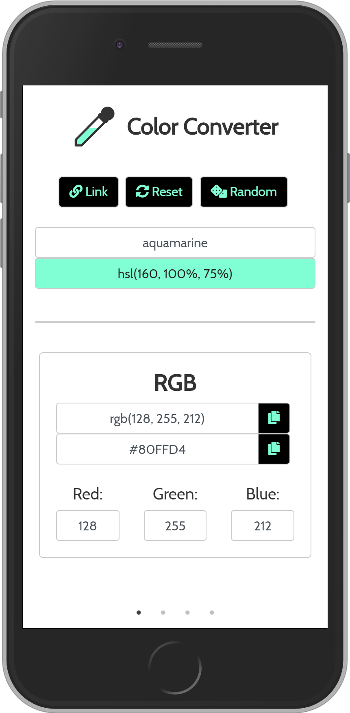

#  Color Convert &mdash; RGB Studios

**https://rgbstudios.org/color-convert/**

**A simple color converter / color picker**

### About

- Switch between RGB, CMYK, HSL, and HSV color modes

- Featuring quick copy buttons, great for CSS

- Type or paste your color right when the page loads, type it in any color format, or any one of 140 names for colors, such as "aquamarine." Supports all [140 color names used in browsers](https://www.w3schools.com/tags/ref_colornames.asp)

- Use the color picker GUI right below to find your perfect color

- Click the link button to generate a link to your color, and copy it to your clipboard

- Click the reset button to reset the color to black and remove the link

- Click the random button for a random color

- When you pick a color, it's featured on our animated logo, our buttons, and on mobile in the theme color

- On mobile, swipe between different color modes, on desktop, view all four at once

### Links

Website: https://rgbstudios.org/color-convert/

Repo: https://github.com/rgbstudios/color-convert

### Made With

Using [Slick](http://kenwheeler.github.io/slick/), [tinyColorPicker](https://github.com/PitPik/tinyColorPicker), [w3color.js](https://www.w3schools.com/lib/w3color.js), and [Font Awesome](https://fontawesome.com/)

**by [Justin Golden](https://justingolden21.github.io) for [RGB Studios](https://rgbstudios.org)**

*RGB Studios Homepage: https://rgbstudios.org*

*Contact RGB Studios: contact@rgbstudios.org*

*RGB Studios on GitHub: https://github.com/rgbstudios*
